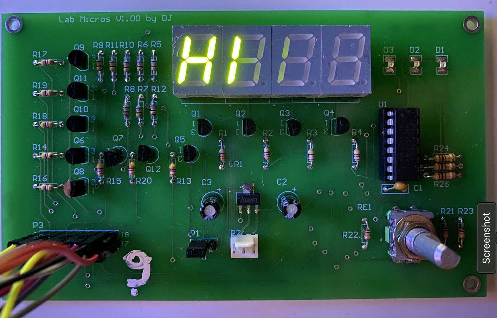
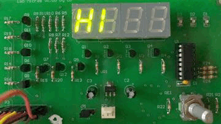

  <a href="#¿Qué-es-esto?">¿Qué es esto?</a> •
  <a href="#como-correrlo">Como correrlo</a> •
  <a href="#vista-previa">Vista Previa</a> •

## ¿Qué es esto?

En este repositorio se encuentra una implementación del control de acceso a un edificio de oficinas mediante una tarjeta magnética y un pin (clave de acceso). Para lograr el objetivo se dispone de encoder rotativo, un display de siete segmentos y un lector de tarjetas magnéticas.

Para ello se carga el programa en una placa de desarrollo Freedom K64F.

Dentro de este repositorio se puede encontrar un Manual de Usuario [el cual puede ver en este link](Manual_de_Usuario.pdf), y una presentacion utilizada para explicar las funcionalidades del sistema.
see documentation [puede ver la presentacion aquí](ControlDeAcceso_Grupo2.pdf).

## Como correrlo

Para correr el programa se necesita disponer de una placa de desarrollo Freedom K64F, una placa que presente un encoder para el control del programa y 4 displays de 7 segmentos todos conectados a un bus de salida para la conexion con la placa, y un lector de tarjetas magnéticas en caso de que se quiera utilizar esta funcionalidad.

Para utilizarlo se ha de cargar el programa en la placa, para ello se la puede conectar a la computadora y abrir el proyecto con MCUExpreso, el cual es un ID que permite añadir el software a la placa de desarrollo.

## Vista Previa?

Aquí podrá ver un conjunto de imágenes que muestran como trabaja el sistema. y un link a un video del sistema funcionando.

 

### Imagenes
 

 

### Gifs

 

## Video

Puedes ver el sistema funcionando completamente pulsando en [este link](www.youtube.com).

El sistema tiene un sistema de bloqueo que bloquea la entrada del usuario luego de que el mismo intentó ingresar su ID mas de 3 veces. <a href="https://drive.google.com/file/d/1FspWqMw6TUyTeOLRhaYkeKkwg4OWUwp-/view?usp=sharing">Esto se puede ver en el siguiente link</a>

El sistema también permite saber si la tarjeta no fue pasada correctamente, esto se puede ver en el <a href="https://drive.google.com/file/d/19-RFVGY65pbczh_6hq6oZze5xewdgScV/view?usp=sharing">siguiente link</a>.

